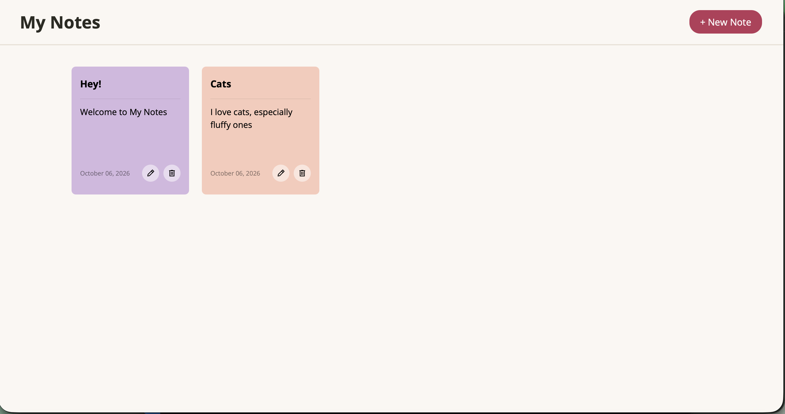
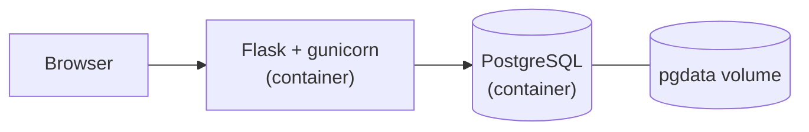

# 🌸 My notes App


My first simple web-app that I built to practice Flask and databases, now containerised with Docker and shipped through a CI/CD pipeline.
You can create, edit and delete notes and pick a color for each one!



## What it does
- Add, edit, delete any note
- Pick from 6 cute colors for each note
- Notes are saved to a database so they don't disappear on refresh

## Built with
- Python + Flask
- SQLAlchemy + PostgreSQL (SQLite as a local fallback)
- HTML + CSS
- Jinja2
- Docker + Docker Compose
- GitHub Actions + pytest

## Architecture



- **web**: the Flask app, served by gunicorn on port 5000 inside the container.
- **db**: PostgreSQL 16. Data lives in a named volume, so notes survive restarts.
- The app reads its database address from the `DATABASE_URL` environment variable and falls back to SQLite when it is not set.

## How to run it locally

With Docker:
1. Clone this repo
2. Run:
```bash
   docker compose up --build
```
3. Go to `http://localhost:5001` in your browser

Without Docker:
1. `pip install flask flask-sqlalchemy`
2. `python app.py`
3. Go to `http://127.0.0.1:5000`

## Tests

```bash
docker compose build web
docker compose run --rm --no-deps web sh -c "pip install -q pytest && pytest -q"
```

## CI/CD

GitHub Actions (`.github/workflows/ci.yml`) runs on every push:
1. **test**: installs dependencies and runs pytest.
2. **build-and-push** (main branch only, after tests pass): builds the Docker image and publishes it to GitHub Container Registry as `ghcr.io/hholyy/notes-app`.

## What I learned
- Building a CRUD app with Flask
- Working with databases using SQLAlchemy
- Connecting frontend and backend with Jinja2
- Designing a clean UI
- What is possible to create without JavaScript
- Containerising an app with Docker and running it with a separate database using Compose
- Configuring an app through environment variables
- Writing a CI/CD pipeline with GitHub Actions
